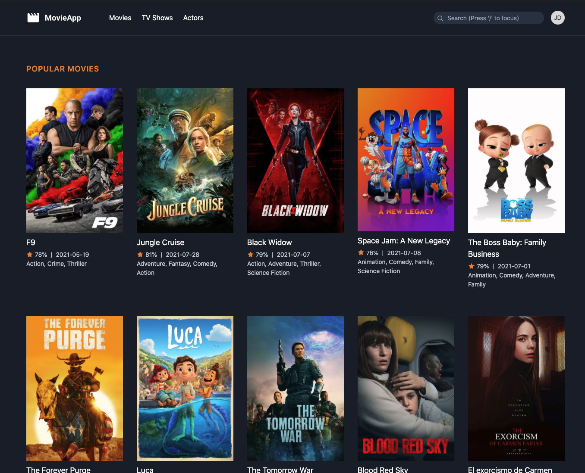
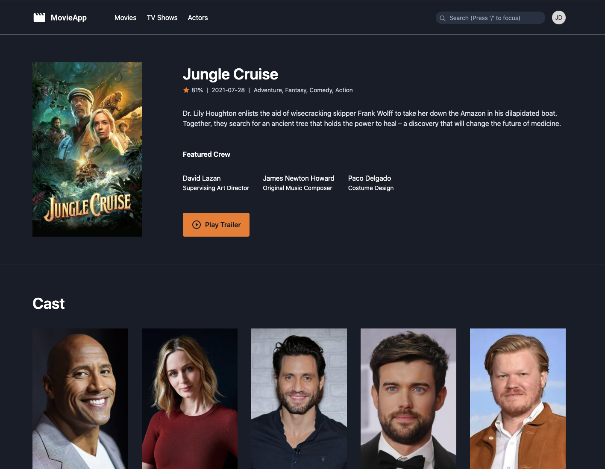

## MovieApp-React

This is the React version of my other project [MovieApp(Laravel)](https://github.com/gid-code/moviapp)

This project use [TMDB](https://developers.themoviedb.org/3/getting-started/introduction) api for movie data

## Screenshot

Home Page


Movie Details Page


## Project Setup

1. Clone the project
2. Make a copy of `src/config/apiConfig_prod.js` and name it `apiConfig_dev.js` in the config directory.
Make the neccessary changes;
```
export const TMDB_TOKEN = your_tmdb_token;
export const TMDB_BASEURL = tmdb_baseurl;
export const TMDB_IMGURL = tmdb_imgurl;
```
3. run `npm install`
